# EffiSend — Agentic Multichain Payments for High-Traffic Venues


> A mobile-first crypto wallet and AI concierge that lets anyone receive, swap, bridge, and spend digital assets across 5 blockchains — verified by face, secured by PIN, guided by an AI agent that speaks your language.

**Platform:** Solana Seeker  
**Channel:** Solana dApp Store  
**Primary Network:** Solana  
**Full Multichain:** Solana · Base · Monad · Hedera · Starknet  
**Stack:** Expo 54 · React Native · `@solana/kit` · Metaplex · Jupiter API · Starknet.js · Ethers.js

---

## The Problem

Crypto payments at high-traffic real-world venues are broken. You have tokens across multiple chains, no idea which account has enough balance, and no fast way to prove who you are without hardware wallets or browser extensions. The cashier is waiting. The queue is growing. The moment is gone.


> **EffiSend was built for Tokyo Dome City — but the architecture is designed for any high-traffic, real-world venue where speed, identity, and multichain liquidity intersect.**

Football stadiums, concert halls, theme parks, transit hubs — anywhere tens of thousands of people need to transact quickly and trustlessly.

---

## How It Works — The Big Picture

EffiSend's architecture is divided into three core pillars that work in harmony to provide a seamless venue experience.

### 1. Wallet Services (Identity & Assets)
The foundation of EffiSend is a biometric-first, non-custodial wallet that abstracts away seed phrases and complex setups.

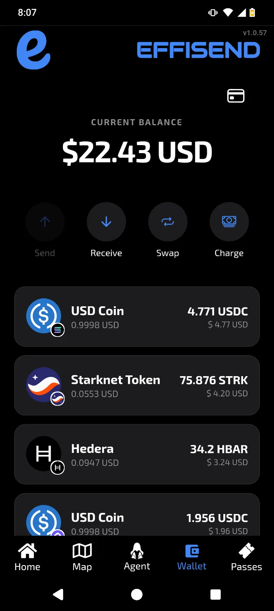 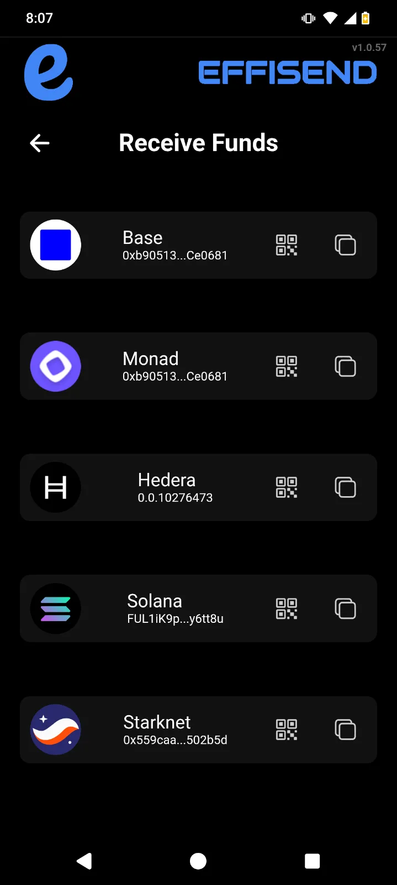 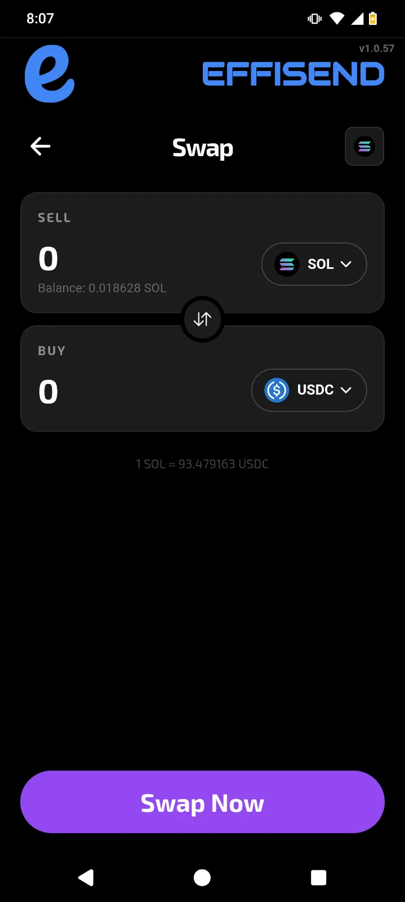

### Wallet Services Diagram:

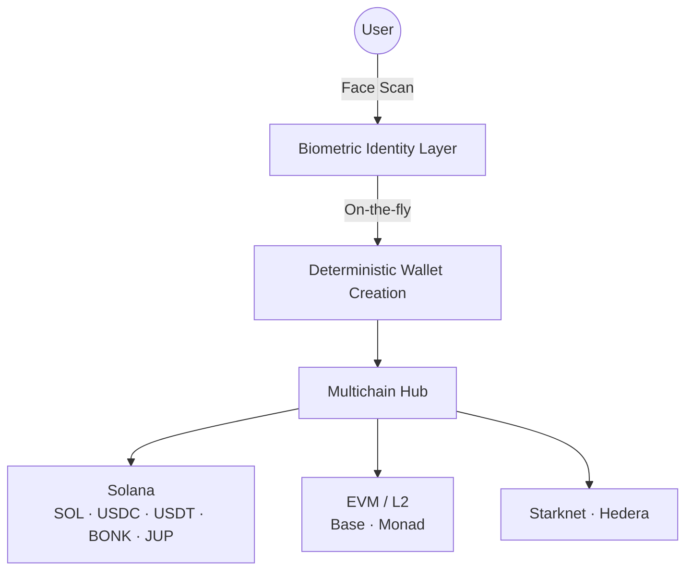

### 2. Information Services (Venue Ecosystem)
EffiSend provides deep, real-time data for high-traffic physical venues, ensuring users have everything they need at their fingertips.

 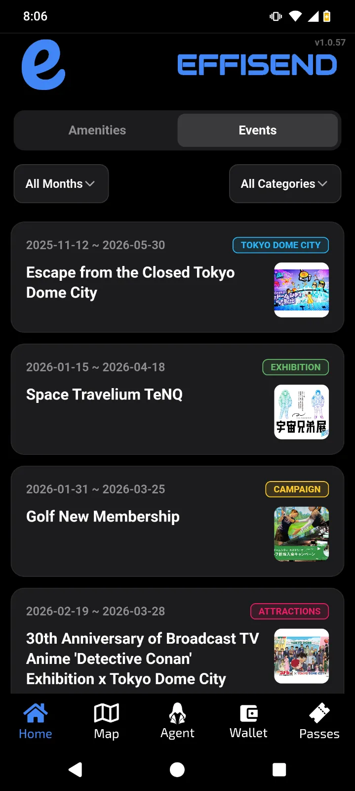 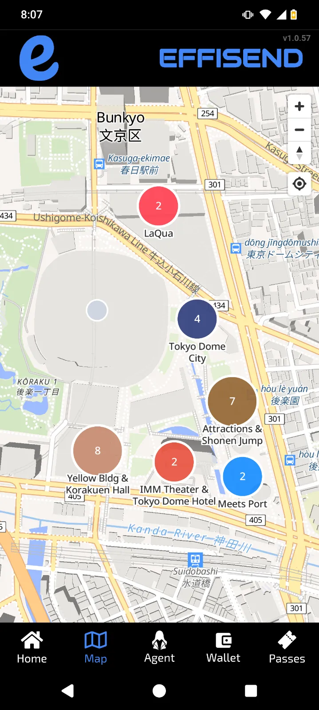

### Information Services Diagram:

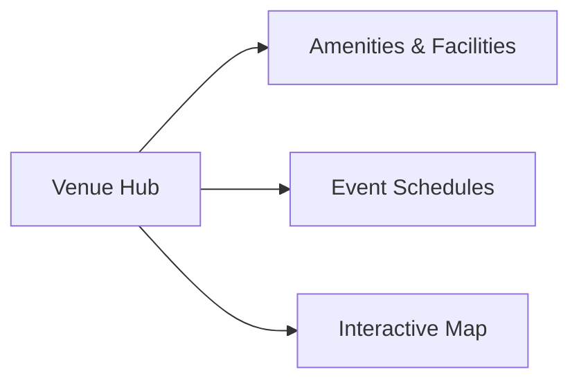

*   **Amenities & Events** — A comprehensive directory of venue facilities (restaurants, security, first aid) and dynamic event schedules.
*   **Interactive Map** — High-performance vector mapping with location-aware navigation to points of interest.

### 3. Agent Services (Intelligence & Execution)
DeSmond, the AI Concierge, translates natural language into complex venue and blockchain operations, acting as a single interface for all user needs.

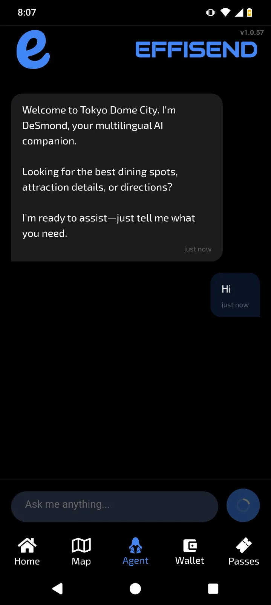 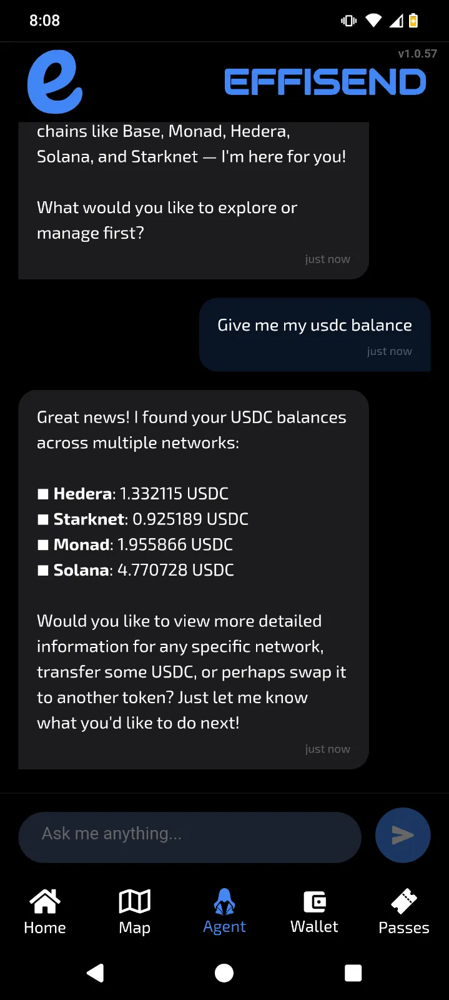 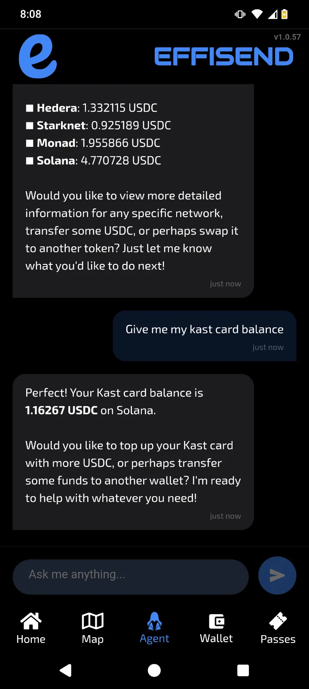

### Agent Services Diagram:

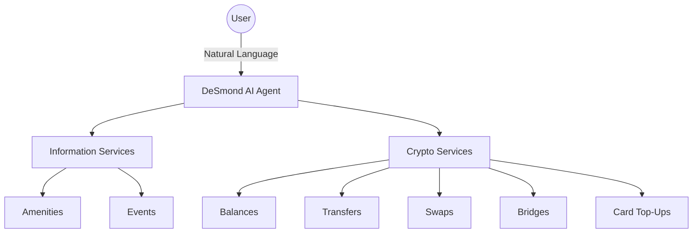

---

## Solana — The Primary Settlement Layer

Solana is not a secondary integration. It is the **heart of EffiSend's architecture** — chosen for its sub-second finality, negligible fees, and rich composable ecosystem.

### SPL Token Support

EffiSend natively manages the following Solana mainnet assets:

| Token | Mint Address | Decimals |
|-------|-------------|----------|
| **SOL** | Native | 9 |
| **USDC** | `EPjFWdd5AufqSSqeM2qN1xzybapC8G4wEGGkZwyTDt1v` | 6 |
| **USDT** | `Es9vMFrzaCERmJfrF4H2FYD4KCoNkY11McCe8BenwNYB` | 6 |
| **BONK** | `DezXAZ8z7PnrnRJjz3wXBoRgixCa6xjnB7YaB1pPB263` | 5 |
| **JUP** | `JUPyiwrYJFskUPiHa7hkeR8VUtAeFoSYbKedZNsDvCN` | 6 |
| **BTC (Wrapped)** | `3NZ9JMVBmGAqocybic2c7LQCJScmgsAZ6vQqTDzcqmJh` | 8 |

### Institutional-Grade Infrastructure

EffiSend is built on the next-generation **@solana/kit** SDK, ensuring high-performance, parallelized token resolution without relying on centralized indexers. 

*   **100% Uptime Architecture** — The system maintains a redundant pool of RPC endpoints with silent, automatic failover. If one node lags, EffiSend switches instantly—the user never sees an error.
*   **Sub-Second Finality** — Leveraging Solana's speed to ensure that real-world payments at a cashier happen at the speed of tap-to-pay.

### Swaps — Jupiter on Solana

When DeSmond or a user executes a swap on Solana, the backend routes through **Jupiter** — the deepest liquidity aggregator on the SVM. Example interaction:

> *"Swap 50 USDC for SOL"* → DeSmond resolves the route → Jupiter finds the best path → transaction signed server-side → confirmation returned in natural language.

---

## Solana Mobile & Distribution Hub

EffiSend is optimized for the **Solana Seeker**, leveraging the world's most advanced web3 mobile hardware to bring agentic payments to the palm of your hand.

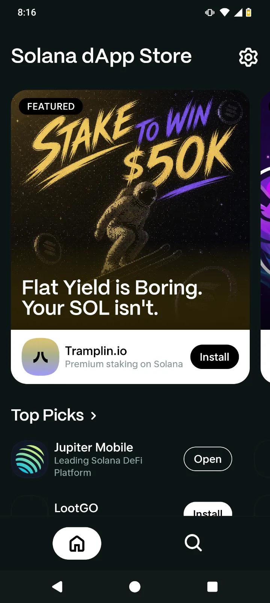 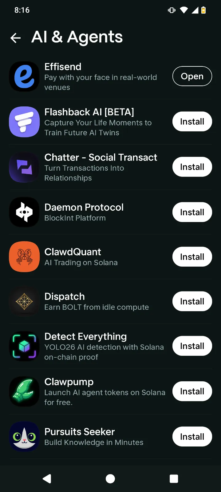 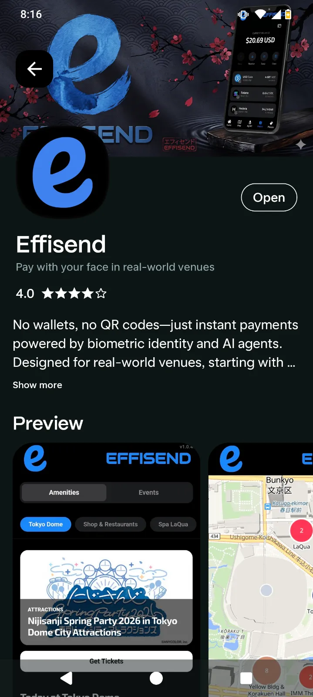

*   **Solana dApp Store Distribution** — By launching on the Solana dApp Store, EffiSend bypasses traditional gatekeepers, reaching a global audience of crypto-native users with zero censorship and a web3-first experience.
*   **Seeker-Native Integration** — Designed to feel at home on the Solana Seeker, ensuring that face-to-face payments and AI-guided operations are fluid, fast, and hardware-secured.
*   **Mass Distribution Strategy** — Our presence in the Solana ecosystem acts as a multiplier, allowing EffiSend to scale across physical venues worldwide by tapping into the existing community of Solana mobile users.

---

## Biometric Identity — The Face Layer

This is the most important innovation in EffiSend. There are **no seed phrases**. There are **no browser extensions**. There are **no hardware wallets**. Your face is your key.

### Wallet Onboarding

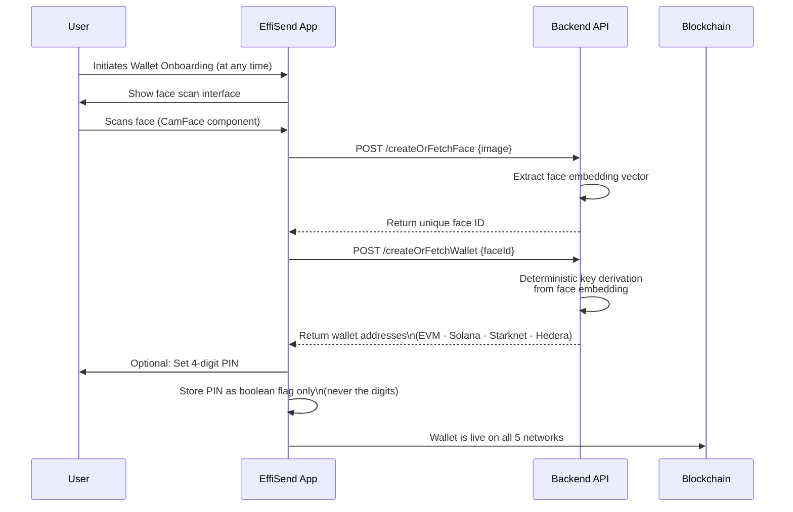

- **Deterministic:** Same face → same wallet, every time. Account recovery is just a re-scan.
- **Non-custodial by design:** Keys are derived from the face embedding — the backend cannot arbitrarily generate them.
- **Hardware-Backed Security:** All sensitive data (including the biometric login flag) is stored in the device's **SecureStore** (encrypted on-device).
- **Brute-Force Protection:** A 3-attempt PIN lockout automatically resets the session, forcing a biometric re-scan to continue.

### The "Face-to-Pay" Experience
 
 This is where EffiSend's power becomes tangible. A merchant shows a USD amount; a customer pays in any token, on any chain, using only their face.
 
 ```mermaid
 sequenceDiagram
    participant M as Merchant Terminal
    participant C as Customer (FaceID)
    participant W as Multichain Wallet

    M->>C: Scan Customer Face
    C->>W: Instant Identity & Balance Resolution
    W->>M: Show eligible tokens across 5 chains
    C->>M: Selects Token (e.g. Solana USDC)
    W->>M: Transaction Signed & Confirmed
    M-->>C: Payment Success ✅
```

**The EffiSend Advantage:**
*   **Intelligent Liquidity Filtering** — Only tokens with sufficient balance are shown, eliminating payment failures.
*   **Parallel Execution** — All 5 blockchains are queried simultaneously; payment resolution happens in milliseconds.
*   **Zero-Touch Interaction** — The customer never touches the merchant's device; identity is verified purely through biometrics.
*   **Flexible Security** — Optional PIN layer for high-value transactions with built-in brute-force protection.

---

## DeSmond — AI Concierge for People and Payments

DeSmond is a proactive, **fully multilingual** AI agent embedded in EffiSend. It automatically detects your language and responds in kind while keeping proper nouns accurate. It covers two distinct domains through a single natural language interface.

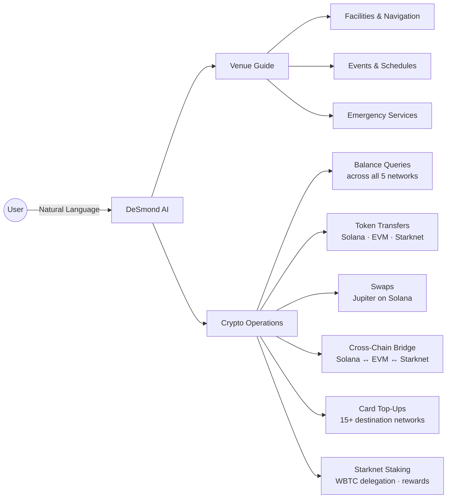

### Venue Guide Capabilities
- **Facility Discovery:** Find restaurants, pharmacies, ATMs, first aid within the venue
- **Event Scheduling:** Real-time schedules for concerts, games, seasonal events
- **Spatial Intelligence:** Walking distances between gates, nearest exits, station access
- **Emergency Access:** Instant location of security, lost & found, medical services

### Solana-Focused Crypto Examples

**Check your full Solana balance:**
> *"How much SOL and USDC do I have?"*  
> DeSmond reads your Solana wallet and returns all token balances in your language.

**Swap on Solana via Jupiter:**
> *"Swap 50 USDC for SOL"*  
> DeSmond routes through Jupiter, finds the optimal path, executes, and confirms.

**Bridge from Solana:**
> *"Bridge 100 USDC from Solana to Base"*  
> DeSmond calculates the bridge fee, selects LI.FI or LayerSwap, and executes — no UI navigation required.

**View your Solana NFTs:**
> *"Show me my NFTs on Solana"*  
> DeSmond resolves all Metaplex metadata from your wallet and describes your collection.

**Fund a card from Solana:**
> *"Top up my Kast card with 50 USDC from my Solana wallet"*  
> DeSmond validates the card alias, routes through the bridge if needed, and confirms the top-up.

> [!NOTE]
> DeSmond communicates exclusively in natural language — no code, no addresses, no chain selectors. It handles all technical routing internally and surfaces only what the user needs to confirm.

---

## NFT & Pass Gallery — Multichain Collectibles

The gallery aggregates digital assets from three chains into a single categorized view:

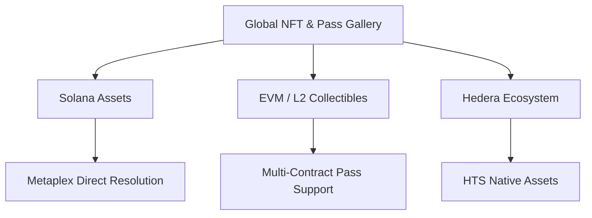

Each NFT card displays: chain badge, asset image, collection name, contract address. Tapping opens a full detail modal. Pull-to-refresh updates the gallery with a 30-second smart cooldown to minimize RPC load.

---

## Unified Liquidity Hub (Tab 4)

EffiSend's main dashboard provides a single source of truth for your multichain net worth, combining real-time pricing with deep liquidity management.

*   **Real-time USD Tracking** — Instant valuation of all SOL, SPL, and cross-chain tokens powered by the CoinGecko API.
*   **Intelligent Balance Polling** — 30-second auto-refresh ensures you always see accurate liquidity before making a payment.

### Crypto Card Management

Register and fund external crypto cards (Metamask, Kast, Bitrefill) directly from your Solana balance. The "Add Card" interface handles the heavy lifting:

1.  **Identity:** Give your card a unique alias.
2.  **Network Routing:** Select the destination network (Linea, Base, Solana, Monad, Starknet, and 10+ others).
3.  **Token Selection:** Choose your preferred funding stablecoin (USDC or USDT).
4.  **Network-Aware Validation:** The UI performs real-time address verification based on the selected chain (checksums for EVM, regex for Solana/Starknet) before allowing the card to be saved.

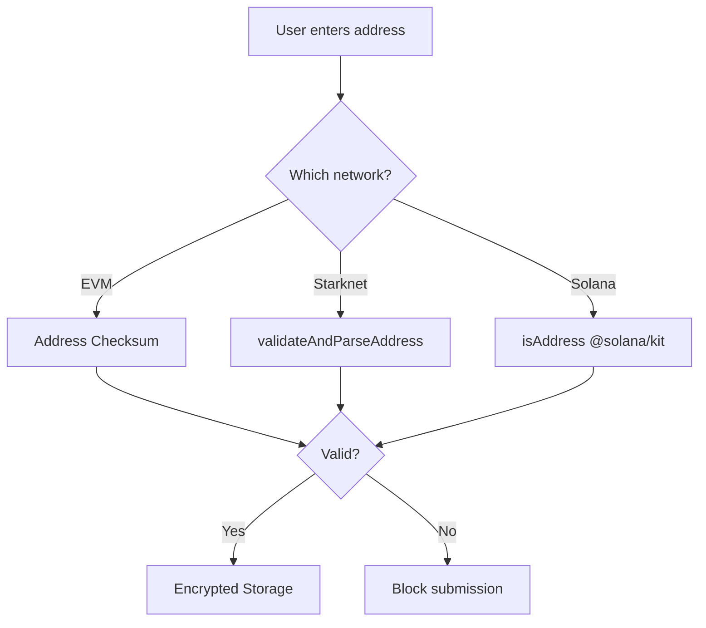

---

