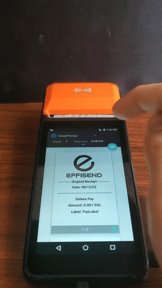

 

# EffiSend-Solana

Welcome, this is our project for Solana Summer Camp Hackathon.

# IMPORTANT!

## Application:

#### APK: 

Main App : https://github.com/altaga/EffiSend-Solana/blob/main/EffiSend-Solana-APK/app-release.apk

POS App : https://github.com/altaga/EffiSend-Solana/blob/main/EffiSend-POS-APK/app-release.apk

## Here is our main demo video: 

# Introduction and Problem

Almost 4 years ago Vitalik Buterin, co founder of Ethereum posted in twitter this message:

At that time it grabbed the attention of almost the entire crypto space and the answers regarding that question were mostly a big “Not many if at all”. Of course, there have been isolated projects that try to work with the developed world with several big names attached, but not to much avail. Cryptocurrencies and blockchain technology from that time onwards has mostly been used by a few early adopters and some others, but were mostly already banked, educated people, even in the developing world. 

Now, let’s ask that same question today; How many unbanked have we banked by the year 2021? Despite having made great progress and having outliers like the country of El Salvador, outside of that, the progress is almost null. Most of the same people that are into crypto today have been in for years and are the same elite, educated, previously banked ones, it has not reached those who are not.   

We can say that because our team lives in one of those developing countries that countless projects try to portray as a target for financial inclusion, which is Mexico. 

And yes, Mexico is the perfect target as it is the largest issuer of remittances from the US and it will break $42Billion this year alone.  

Of course, remembering that the US is the biggest sender of remittances in the world.

It is important to mention that, according to the World Bank, 65% of Mexican adults do not have any type of bank account and only 10% save through a financial institution, in addition to the fact that 83% of Mexican adults do not have access to electronic payment systems. These circumstances limit the potential of the sector to place the resources of savers in productive projects that generate economic development and well-being for the population. And crypto is not doing better than the legacy system, most of the users are people like our team, tech savvy with a certain degree of education and already banked.

# Solution

Effisend is a Mobile-First wallet, cash out ramp and Point of Sale Superapp. We combine TradFi through Stripe with Web3 to improve Financial Inclusion in Mexico and LATAM

System's Architecture:

- All Solana transactions are controlled through [Solana web3.js](https://solana-labs.github.io/solana-web3.js/) and [Solana Pay](https://www.npmjs.com/package/@solana/pay) on mainnet.

- Thanks to the Stripe APIs we can manage users, checkout, swap and KYC of our app. (https://stripe.com/docs/api)

# Main App Screens:

    

- In turn, through Stripe and Solana we can have total control of the movements and transactions of our account in both Crypto and Fiat.

- The KYC of our application is controlled by Stripe and to confirm it, the documents must match the user's registration.
   - To perform the KYC you just have to go to the Verify button.
   - Click the button and wait.
   - Once the link to verify is ready, clicking the button again will take us to the web page where we must upload our documents.
  
        

- Through Solana we can also make transfers directly between Solana Wallets or with Solana Pay.

  - First we must click on the QR code at the top.
  
    

  - We must select if we want to Recieve or Scan/NFC (by default the app opens the Recieve option). In the case of this main app, payment is allowed through NFC to our POS as part of the adoption of this technology in traditional payments.
  
    
    

  - In the case of Scan/NFC, we open a QR scanner which will take us through a very simple transfer process, each transaction needs biometric or pin confirmation.

    
    
    

  - Transaction if you want to check: https://solscan.io/tx/5wqWa3r4Ftb7iEW6oikXzdmKzZaR9W2eL1ko2sDNTgckYPGh4ssqAgEV6MxcbPpqbMgKxtCYGWZcXXB11YVn2Ffw
  
    

- We carry out Solana and Fiat transfers by coordinating the services of Solana and Stripe. Transferring the equivalent of SOL or USD currency from EffiSend Master accounts.

  

- At the same time, we can obtain a virtual card from the Stripe API to be able to spend the money from our Fiat account directly.

  

- Additionally, we can make a Card Debit deposit from our Fiat account to a any debit cards.

  
  

- All transfers made in the demos and during development can be consulted in the explorer.

  https://solscan.io/account/4hTMoGhXSjthYhm8kaBidkeNsYPE1N6JYW3g4KePyJjo

- This is a screenshot of our backend in Stripe.

  

# Point of Sale application:

- The Point of Sale application is more focused on the simple reception of payments and an interface focused on generating payment orders through QR or NFC.

  
  

- The POS allows us to see the Crypto and Fiat balances received along with the list of transactions just like the Main App.

  
  

- One of the most important processes is being able to make payments at the POS through Solana Pay, being this the pillar of our device. (At this point the data at Label, Message and Memo are fillable fields, but in the future these will be with data of the establishment or person receiving the payment)

  
  
  

- When the reference is created by QR, it can be paid through any wallet compatible with Solana Pay, however our Main App also allows payment through NFC.

  - Main App / POS App:
  
     

- Once the reference payment has been made, we will be able to see the confirmed and verified messages.

    

- In addition, we provide a printed receipt with the URL where you can check your transaction.

   

- Let's print!

# Current state and what's next

This application is directed at those who cannot benefit directly from cryptocurrency. It has the usual, both crypto and fiat wallets, transfers between crypto and fiat, transfers between crypto accounts and it gives a spin on the cash in - cash out portion of the equation as no other project provides it. It is very important if this application is going to benefit and bank people to be very agile and compatible with FIAT at least until crypto reaches mass market. Most of the developed world has not even incorporated to legacy electronic systems. In addition to that the incorporation of a Point of Sale thought mainly for SMEs is something that can be key in augmenting the change for further adoption. 

I think we can make the jump from those systems almost directly to self-banking, such as the jump that was made in some parts of Africa and even here in Latin America from skipping telephone landlines directly to Mobile phones. If that jump was made from that type of technology this one can be analogous and possible. 

Perhaps the most important feedback we have obtained is that we have to show how our application will ensure the enforcement of anti-laundering laws. 

We will do that will strong KYC. And at the same time Mexico has published since 2018 strong laws to manage that including its fintech law.

https://en.legalparadox.com/post/the-definitive-guide-mexican-fintech-law-a-look-3-years-after-its-publication#:~:text=The%20Mexican%20FinTech%20Law%20was,as%20Artificial%20Intelligence%2C%20Blockchain%2C%20collaborative

Quoting: " The Mexican FinTech Law was one of the first regulatory bodies created specifically to promote innovation, the transformation of traditional banking and credit financial services that would even allow the possibility of incorporating exponential technology such as Artificial Intelligence, Blockchain, collaborative economies and peer-to-peer financial services in secure regulatory spaces. "

All of this was a silent revolution that happened in this jurisdiction after the HSBC money-laundering scandal that included cartels and some other nefarious individuals. 
https://www.investopedia.com/stock-analysis/2013/investing-news-for-jan-29-hsbcs-money-laundering-scandal-hbc-scbff-ing-cs-rbs0129.aspx

Thus, the need for Decentralized solutions.

Security and identity verification of the clients who use the app is paramount for us, and to thrive in this market we need this to emulate incumbents such as Bitso. We think our technology is mature enough if we compare with these incumbents and much safer. 

Regarding the application we would like to test it with real Capital perhaps in Q4 2022.

Hopefully you liked the Mobile DApp and Point of Sale.

# Team

#### 3 Engineers with experience developing IoT and hardware solutions. We have been working together now for 5 years since University.

## References:

https://egade.tec.mx/es/egade-ideas/opinion/la-inclusion-financiera-en-mexico-retos-y-oportunidades

https://www.cnbv.gob.mx/Inclusi%C3%B3n/Anexos%20Inclusin%20Financiera/Panorama_IF_2021.pdf?utm_source=Panorama&utm_medium=email

https://www.inegi.org.mx/contenidos/saladeprensa/boletines/2021/OtrTemEcon/ENDUTIH_2020.pdf

https://www.cnbv.gob.mx/Inclusi%C3%B3n/Anexos%20Inclusin%20Financiera/Panorama_IF_2021.pdf?utm_source=Panorama&utm_medium=email

https://www.rappi.com

https://www.rapyd.net/

https://www.pointer.gg/tutorials/solana-pay-irl-payments/944eba7e-82c6-4527-b55c-5411cdf63b23#heads-up:-you're-super-early
